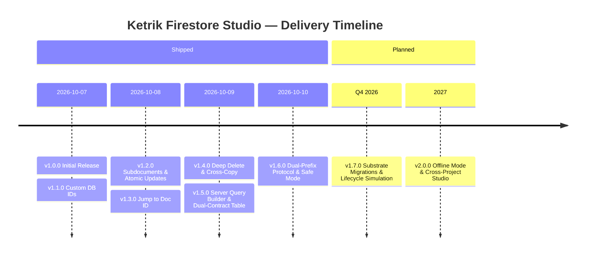

# Ketrik Firestore Studio — Product Roadmap & Release Schedule

This document outlines the version milestones, historical release dates, and strategic roadmap for **Ketrik Firestore Studio**.

---

## 📅 Release History & Milestones

| Version | Status | Release Date | Key Focus Areas |
| :--- | :--- | :--- | :--- |
| **v1.0.0** | Shipped | 2026-10-07 | Multi-connection explorer, virtual JSON editor, basic collection tables |
| **v1.1.0** | Shipped | 2026-10-07 | Named custom database IDs (`(default)` and custom instances), UI badges |
| **v1.1.1** | Shipped | 2026-10-07 | Paging offset fixes, gRPC connection handling |
| **v1.2.0** | Shipped | 2026-10-08 | Root variables as virtual subdocuments, atomic partial updates, tree fields |
| **v1.2.1** | Shipped | 2026-10-08 | Modal QuickPick for booleans/numbers/strings, tree sync fixes |
| **v1.3.0** | Shipped | 2026-10-08 | Direct 1-read document ID jump (Tree & Table views), quota protection |
| **v1.4.0** | Shipped | 2026-10-09 | Deep recursive delete, duplicate doc, cross-connection copy/paste, memory cleanups |
| **v1.5.0** | Shipped | 2026-10-09 | Server-side query builder (multi-clause `where`), Map/Array field table view (`openFieldAsTable`), atomic field rename, granular refresh |
| **v1.6.0** | Shipped | 2026-10-10 | Dual-Prefix protocol (`_` & `__`), Tree hierarchy badging, Table column zones & noise toggles, protocol query presets, safe mode mutation guards, cross-substrate paste |
| **v1.7.0** | Planned | Q4 2026 | Substrate migration wizard (Explode $\leftrightarrow$ Consolidate), time-travel lifecycle preview, TypeScript schema generator |
| **v2.0.0** | Future | 2027 | Local offline cache & sync, cross-database schema diffing, visual security rules simulator |

---

## 🚀 Upcoming Releases

### [v1.6.0] — Dual-Prefix Protocol & Protocol Safety (Target: October 2026)

*Theme: Native architectural support for the Dual-Prefix (`_` and `__`) convention and anonymous namespaces (`"__": { ... }`), enabling clean separation of system envelopes, operational state, and domain data.*

* **Dual-Prefix Visual Hierarchy (Explorer Tree)**:
  * **System Protocol (`__key` / `"__": { ... }`)**: Rendered with dedicated operational state/security badge icons (`$(shield)` / `$(gear)`).
  * **System Envelope (`_key`)**: Rendered with index/metadata badge icons (`$(tag)` / `$(symbol-key)`) indicating query dimensions (`_cat`, `_kind`, `_ts`, `_ch`).
  * **Domain Content**: Traditional type icons (`$(symbol-string)`, `$(symbol-number)`).
  * **Smart Field Sorting**: Logical grouping when expanding documents: `id` $\rightarrow$ `__` $\rightarrow$ `_` $\rightarrow$ domain content.
* **Smart Table Column Partitioning & Noise Toggles**:
  * Pinned Identity column (`id` / `uid`).
  * Grouped System Envelope columns with subtle tinting.
  * Collapsible/grouped Protocol columns (`__.active`, `__.from`, `__.exp`).
  * Toolbar toggle buttons: *"Hide Protocol (`__`)"* and *"Hide Envelope (`_`)"* to let copy editors focus purely on domain content.
* **Server Query Builder Protocol Shortcuts**:
  * Dot-path autocomplete for nested namespace fields (`__.active`, `__.exp`, `__.targetUid`).
  * Instant filter presets: `[⚡ Active Only]`, `[⏱ Expired / Inactive]`, `[📂 Filter by _kind/_cat]`.
* **System Key Mutation Guard (Safe Mode)**:
  * Optional configuration setting `ketrik-firestore-studio.security.protectSystemKeys` (default: `true`).
  * Confirmation dialog when attempting to mutate or delete root `id`, immutable envelope `_` keys, or protocol `__` blocks.
  * Sanitized document duplication: Option to strip or reinitialize system envelopes and protocol state (`_ts = Date.now()`, `__.active = false`).
* **Cross-Substrate Clipboard Flow**:
  * Copy collection document $\rightarrow$ Paste into in-document Map/Array field (`Record<string, T>`).
  * Right-click item in Map/Array table view $\rightarrow$ Paste as Collection Document.

---

### [v1.7.0] — Substrate Migrations & Lifecycle Simulation (Target: Q4 2026)

*Theme: Tools for evolving database architectures and testing time-dependent data.*

* **Substrate Migration Wizard (Explode $\leftrightarrow$ Consolidate)**:
  * **Explode**: Convert bounded document maps approaching the 1MB Firestore threshold (`doc.items: Record<string, T>`) into full subcollections or root collections using batched operations.
  * **Consolidate**: Compress small collections into single aggregate document dictionaries (`Record<string, T>`) with atomic updates to cut down per-read billing.
* **Time-Travel Lifecycle Preview**:
  * Virtual time slider in Table and Document views to preview live/scheduled/expired documents based on protocol temporal bounds (`__.from` and `__.exp`).
  * Visual status pills in table rows: `🟢 Active`, `🟡 Scheduled`, `🔴 Expired`, `⚪ Inactive`.
* **Tombstone Purge Utility**:
  * Automated cleaner for soft-deleted registry keys (e.g. `{ [key]: null }` or `deletedAt: Timestamp`) with safety dry-runs.
* **TypeScript Contract & Adapter Generator**:
  * One-click generation of typed interfaces (`NotificationDoc`, `NotificationProtocolZone`, etc.) and dual-contract destructuring adapters from live collections or sample documents.

---

### [v2.0.0] — Enterprise Studio & Offline Experience (Target: 2027)

*Theme: Enterprise multi-tenant workflows and next-generation offline development.*

* **Local Offline Cache & Mocking**:
  * Work offline with local SQLite/IndexedDB caches of remote documents with automatic drift detection and push synchronization.
* **Cross-Project Schema & Data Diff Viewer**:
  * Side-by-side graphical diff between environments (e.g. comparing Production vs. Staging collections or document structures).
* **Security Rules Simulator**:
  * Interactive debugger and tester for `firestore.rules` directly within VS Code, validating permissions against simulated auth tokens.
